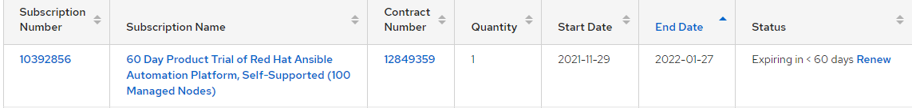
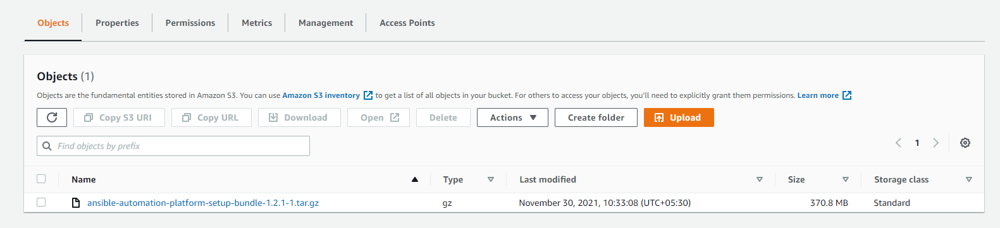
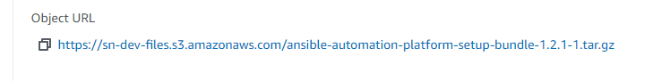
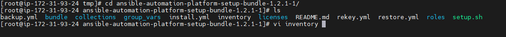
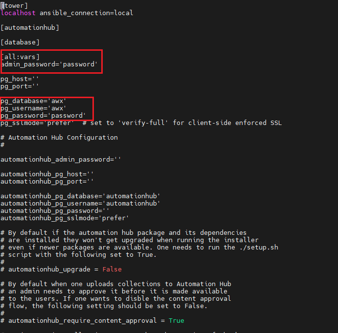
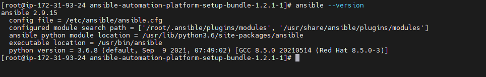
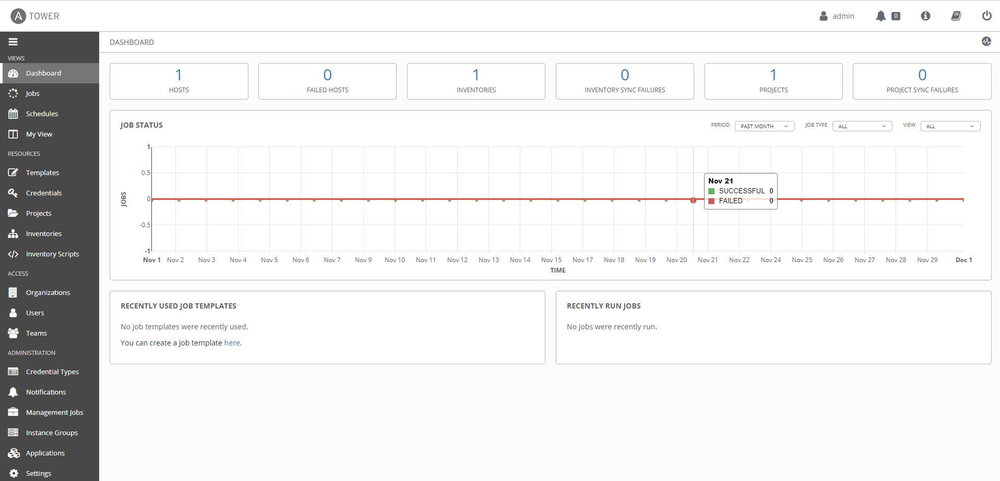

# Install Ansible Tower

## Pre-requistes:

**Supported Operating Systems**

* Red Hat Enterprise Linux 7.7 or later 64-bit (x86)
* CentOS 7.7 or later 64-bit (x86)

    * 2 CPUs minimum
    * 4 GB RAM minimum
    * 20 GB of dedicated hard disk space
<br/><br/>
* Ports 80 and 443 needs to be opened.
* 80 for HTTP.
* 443 for HTTPS. 

**AWS EC2 Instance Size of m4.large or larger**

## Steps:

1. Register in Redhat portal for Ansible Tower ( https://www.ansible.com/products/controller ) with company email address
2. Download the Anisble tower package
3. Launch RHEL Ec2 Instance in AWS
4. Install the Package in Ec2 Instance
5. Login to the Ansibl tower in web browser and activate the trial license with Redhat customer id and password

## Installation

**Single Machine as an integrated Installation**

### Check the Subscription page in Redhat portal to confirm trial license was activated for Ansible Tower



### Upload downloaded Ansible Tower Pakage to S3 Bucket and Allow Public Access



### Copy the url of the Ansible Tower Package from in S3 Bucket



```sh
#change to root user
sudo su -

#update the instance
yum update

#reboot the instance
reboot

#after reboot the instance change to root username
sudo su -
cd /tmp/
```
```sh
#install wget package
yum install -y wget

#download the Ansible tower pakage from S3 bucket using wet
wget <ansible tower package url>
#wget https://sn-dev-files.s3.amazonaws.com/ansible-automation-platform-setup-bundle-1.2.1-1.tar.gz
```
```sh
#unzip the downloaded package
tar xvf ansible-automation-platform-setup-bundle-1.2.1-1.tar.gz

#change directory to unzipped folder
cd ansible-automation-platform-setup-bundle-1.2.1-1/

#edit the inventory file
vi inventory 
```


### Set the admin_password and pg_password



Save and exit form vi editor and run the setup file

```
./setup.sh
```

after setup finished check the ansible version

```
ansible --version
```


### You can access Ansible tower

```
https://server-ip-address
```

Username: admin

Password: (this password is when edit the inventory file)

**After login ansible tower in tower license provide redhat user name and password when we create download the ansible package from Redhat portal.**

