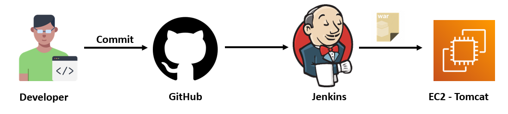
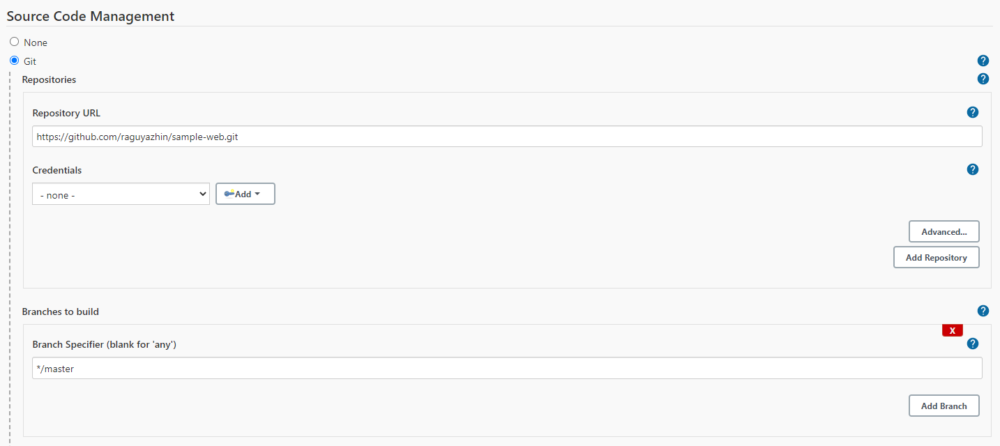
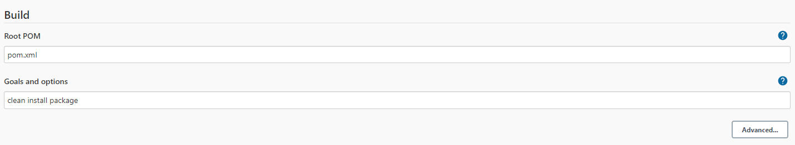
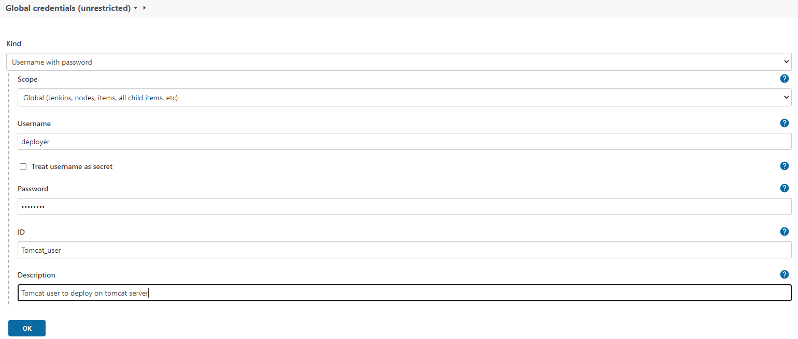
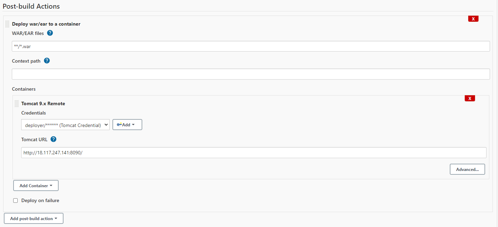
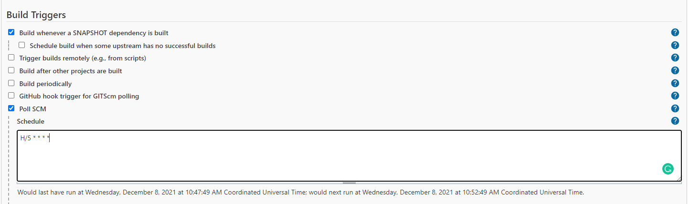

# CI CD Project - 01

## Java Web Application ( WAR ) file Deployment.

### Jenkins fetch Java Code from GitHub, Build a WAR file and deploy to Tomcat Server

## Pre-requistes:

* #### EC2 instance with Tomcat Serer [Installation steps here](../Tomcat/install-tomcat-ec2.md)
* #### Jenkins Server [Installation steps here](../Jenkins/install-jenkins-docker-compose.md)

## Steps for Integration
1. Login to Jenkins console
    - `New Item` > `Maven project`
2. Create Jenkins job, Fill the following details,    
    - Source Code Management:
        - git : `https://github.com/raguyazhin/sample-web.git`
        - Branches to build : `*/master`
    - Build:
        - Root POM : `pom.xml`
        - Goals and options : `clean install package`

## Steps for Deployment
- Install `deploy to container` plugin. this is need to deploy on tomcat server.
- Install `maven` plugin without restart

`Manage Jenkins` > `Jenkins Plugins` > `available` > `deploy to container`

*Setup credentials for need Jenkins Server access to deploy war file to Tomcat server*

- setup credentials
    - `credentials` > `jenkins` > `Global credentials` > `add credentials`
        - Username : `deployer`
        - Password : `XXXXXXX`
        - id : `Tomcat_user`
        - Description: `Tomcat user to deploy on tomcat server`

- post Steps
    - `Post-build Actions` > `Add post-build action`
        - Deploy war/ear to container
        - WAR/EAR files : `**/*.war`
        - Containers : `Tomcat 9.x`
        - Credentials: `Tomcat_user`
        - Tomcat URL : `http://<PUBLIC_IP>:<PORT_NO>`

**Save and Build Now**

## Steps for Continuous Integration and Continuous Deployment (CI/CD)

Now job running fine so add continuous integration and deployment to add below steps.

- Build Triggers
    - Poll SCM
        -schedule H/5 * * * *

Every 5 minutes check github repository if any changes in code then fetch from repository and bulid the code and deploy to tomcat server.

To check modify code and commit to github, jenkins automatically detect the code, fetch and build the code and deploy.