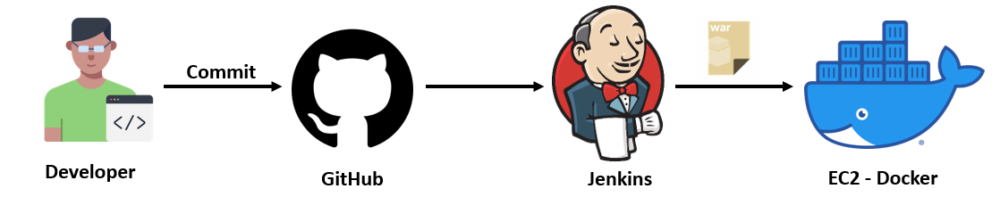
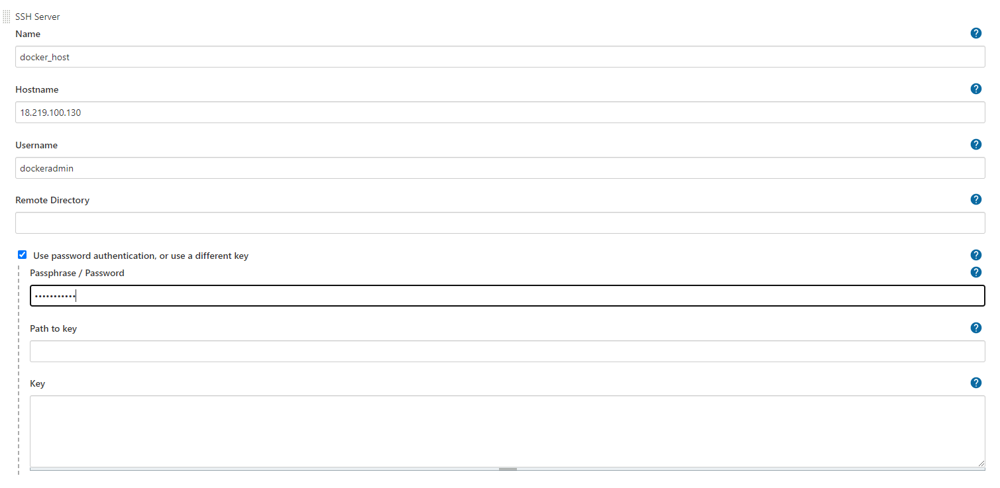
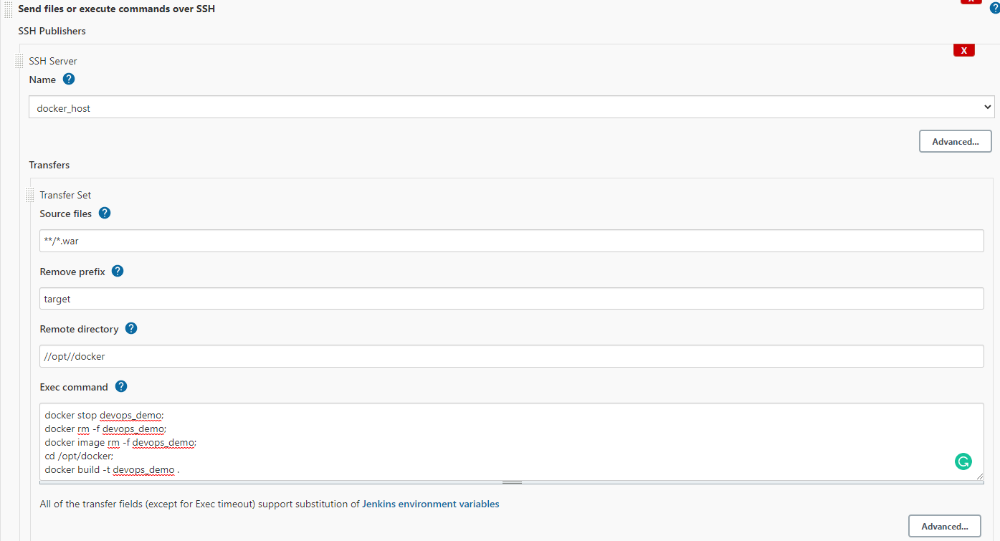
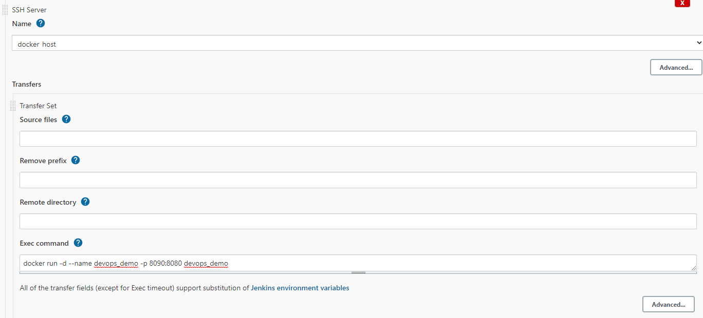
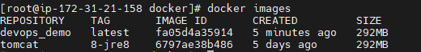
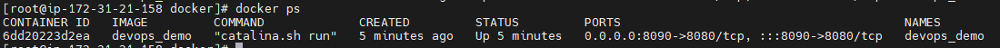

# CI CD Project - 03

## Java Web Application ( WAR ) file Deployment.

### Jenkins fetch Java Code from GitHub and Build a WAR file, Built Artifact is copied to Docker Server then Docker Server create Tomcat Docker container using Dockerfile after Artifact copied to Tomcat webapp folder.




## Pre-requistes:

* #### EC2 instance for Install Docker
* #### Jenkins Server [Installation steps here](../Jenkins/install-jenkins-docker-compose.md)

## Install Docker on EC2 instance

```sh
sudo su -

cd /

#updating amazon linux patches
sudo yum update -y
#installing docker engine
sudo amazon-linux-extras install docker -y
#starting docker service
sudo service docker start
#enabling docker service
sudo chkconfig docker on

#Reboot the EC2 instance
docker info
```
### Create dockeradmin User

```sh
sudo su -

cd /

useradd dockeradmin
passwd dockeradmin

#change the dockeradmin password

#Adding user dockeradmin to docker group
usermod -a -G docker dockeradmin

```

### Create Docker folder

```sh
cd opt/
mkdir docker
```

### Give a permission to dockeradmin for docker folder
```
groupadd optgrp
chown root:optgrp /opt/
usermod -aG optgrp dockeradmin
chmod 775 /opt/docker
```
Or

```
chown -R dockeradmin:dockeradmin /opt/docker
```

### Create Dockerfile

```sh
cd /opt/docker

vi Dockerfile
```
#### Copy the below code in Dockerfile save and exit

```
# pull Tomcat image 
From tomcat:8-jre8 

# Maintainer
MAINTAINER "devops" 

# copy war file on to container 
COPY ./sample-web.war /usr/local/tomcat/webapps
```
#### Enable Password based Authendication

```sh
# Change PasswordAuthentication no To PasswordAuthentication yes
vi /etc/ssh/sshd_config

#Restart SSH Service
service sshd restart
```
## Jenkins Integration Steps

Install "publish Over SSH"

- `Manage Jenkins` > `Manage Plugins` > `Available` > `Publish over SSH`

Enable connection between Ansible and Jenkins

-   `Manage Jenkins` > `Configure System` > `Publish Over SSH` > `SSH Servers`

    - SSH Servers:
        - Name: `docker_host`
        - Hostname: `<Docker Host IP>`
        - username: `dockeradmin`
        - password: `*******`
    - Test the connection "Test Connection"



## Create Jenkins job

- Source Code Management:

    - Repository : `https://github.com/raguyazhin/sample-web.git`
    - Branches to build : `*/master`

- Build:

    - Root POM : `pom.xml`
    - Goals and options : `clean install package`

- Add post-build steps

    - Send files or execute commands over SSH
        - SSH Server : `docker_host`
        - Source fiels : `**/*.war`
        - Remove prefix : `target`
        - Remote directory : `//opt//docker`
        - Exec command :
        ```
        docker stop devops_demo;
        docker rm -f devops_demo;
        docker image rm -f devops_demo;
        cd /opt/docker;
        docker build -t devops_demo .
        ```


- Add post-build steps

    - Send files or execute commands over ssH
        - SSH Server : `docker_host`
        - Exec command : `docker run -d --name devops_demo -p 8090:8080 devops_demo`



**Save and Build Now**

### Check whether Image and Container created on Docker host through Jenkins job

```
docker images
```


```
docker ps
```


Access web application from browser which is running on container

```
<docker_host_Public_IP>:8090/sample-web/
```
