# CI CD Project - 05

## Java Web Application ( WAR ) file Deployment.

### AWS Code Pipeline fetch Java Code from GitHub through AWS Code build, Build a WAR file and deploy to AWS Elastic Beanstalk Tomcat

---

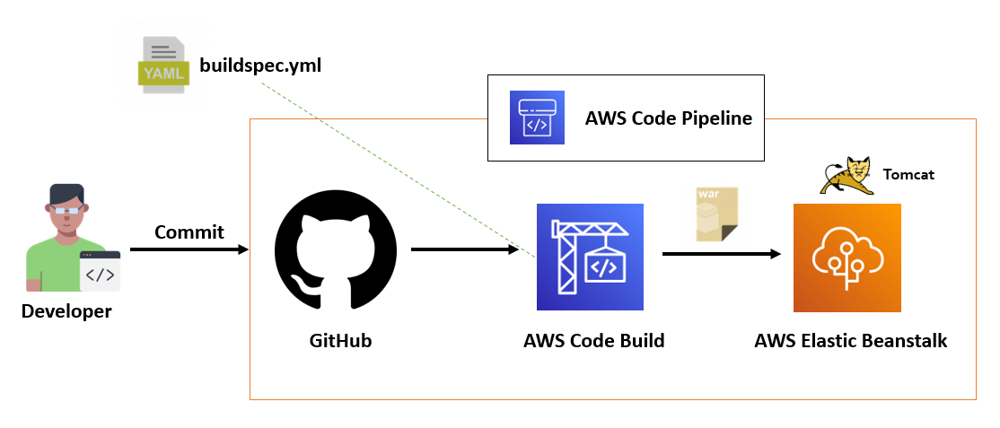

### Step 1 -  Create AWS Elastic Beanstalk Environment for Deploy Application
`AWS Console` -> `Elastic Beanstalk` -> `Create Application`
```
1. Provide Application Name

2. If want Application Tags add it

3. Platform
   1. Choose Platform - Tomcat
   2. Branch - Select tomcat Version
   3. Version - Select Version

4. Application Code
   1. Select Sample Application

5. Click Create Application
```
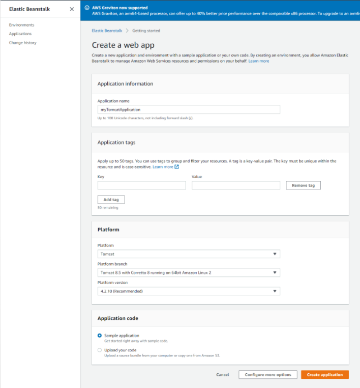

`AWS Console` -> `CodePipeline` -> `Create pipeline`
```
1. Enter Pipeline name

    1.Service Role -> New service role
    2.All other options leave it as default.
    3.click Next
```
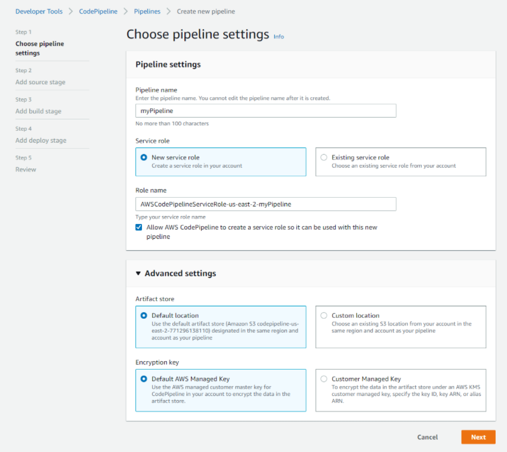
```
5. Source Provider -> GitHub (Version 2)
6. Click Connect to GitHub
7. In Connection Window Enter Connection Name
8. Click Connect to GitHub
9. Click Install a new app
10. follow the steps and click Connect
11. After the GitHub Connection Process Completed Select Repository Name and Branch Name
12. Check Start the pipeline on source code change
13. output arifact format -> CodePipeline default
14 Click Next
```
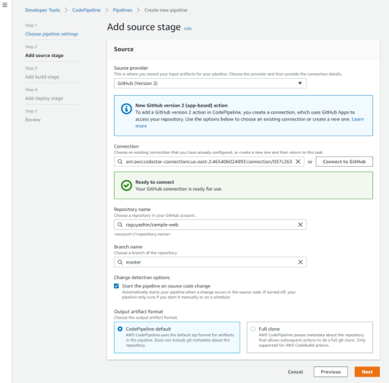

```
15. Select Build Provider -> Select AWS CodeBuild
16. Click Create Project
    follow the steps refers the screenshots
17. build type -> Single build
18. Click Next
```
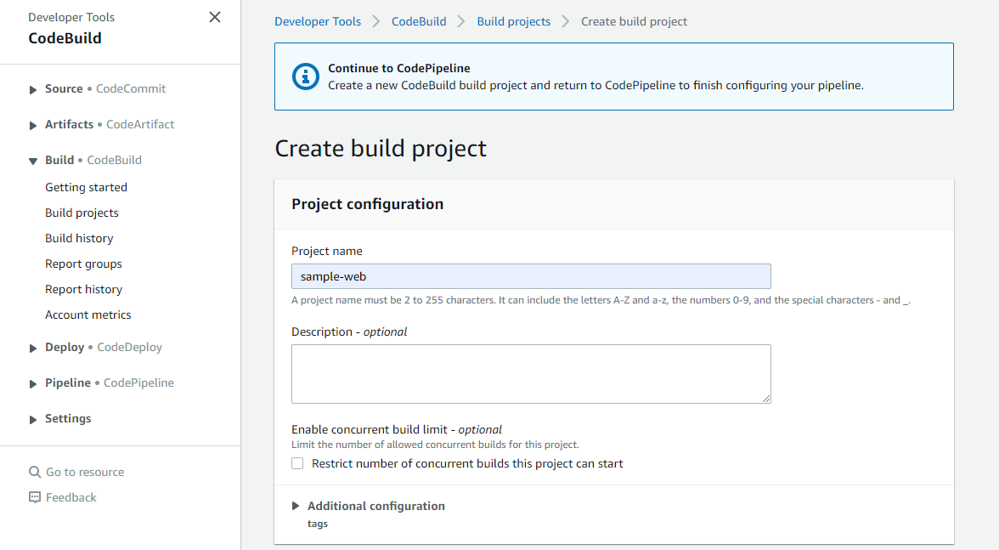

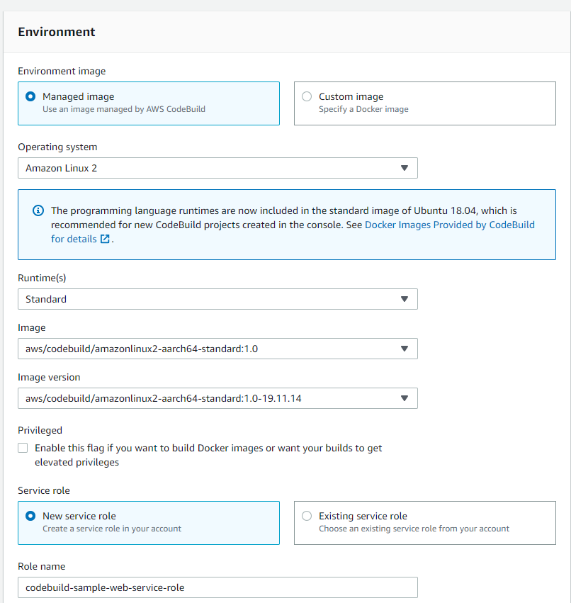

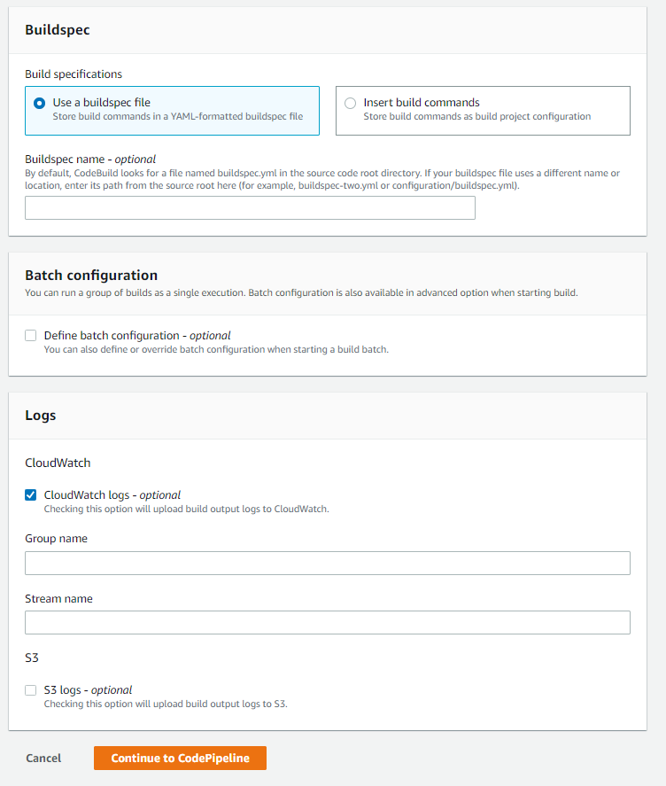

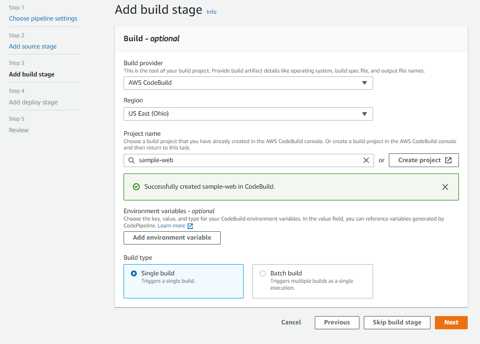

```
19. In Deploy Stage -> Deploy provice -> select AWS Elastic Beanstalk
20. Select Application name and Environment name
21. Click Next
22. Click Create pipeline
```


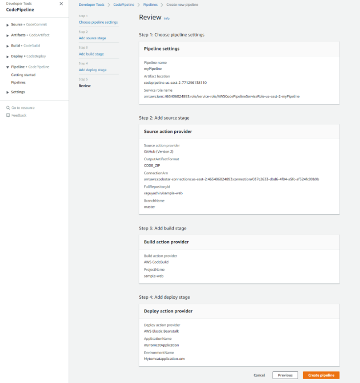


Access web application from browser which is running on container

- get the url from elastic Beanstalk Environment

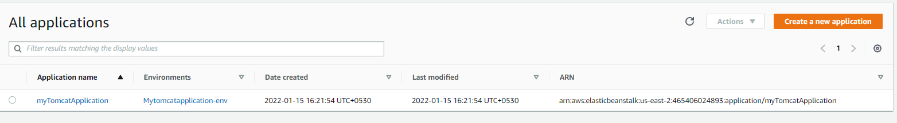

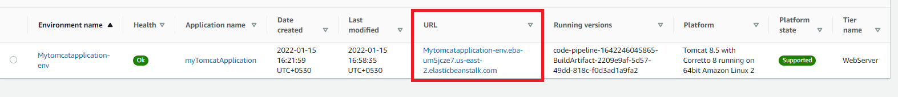

paste the url from get it from elastic Beanstalk Environment/##WAR FILE NAME##

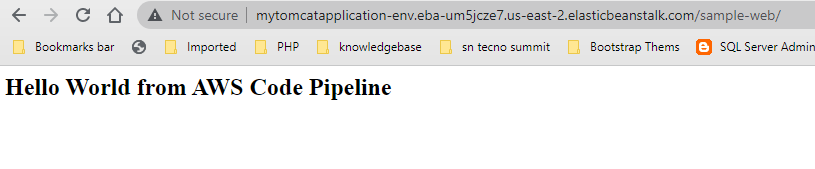