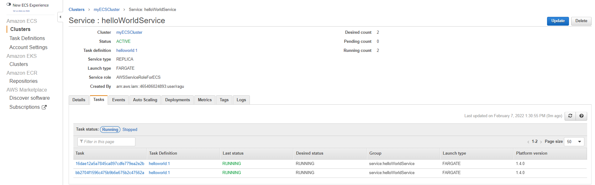
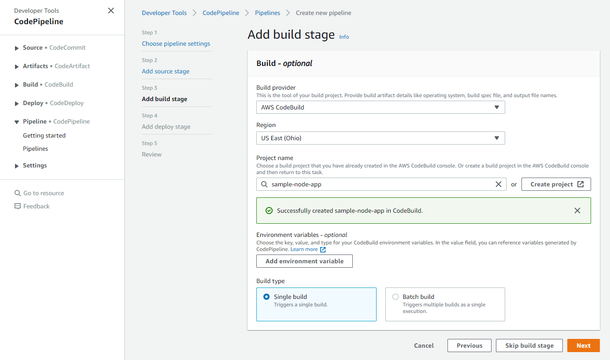

# CI CD Project - 06

## Dockerizing Node JS Application to Deployed on ECS Fargate.

### AWS Code Pipeline fetch Code from GitHub through AWS Code build, Build a Docker Container Stored ECR and deployed to AWS ECS Fargate

---

### ***Create Application Load Balancer***

#### 1. Open EC2 Console and Select ***Load Balancers***

#### 2. Select load balancer type ***Application Load Balancer***

#### 3. Create Target Group

#### 3. Register targets

#### 4. Enter ***Load balancer name*** and ***VPC*** and ***Security Groups*** and ***Target Groups***

### ***Create AWS ECS Cluster Environment for Deploy Application***

#### 1. Go to AWS Elastic Container Service (ECS)

#### 2. Click Create Cluster

#### 3. Select Cluster template ***Networking only*** and Click ***Next Step***

#### 4. Enter ***Cluster name*** and Click ***Create***

#### 5. Select ***Task Definitions*** and Click ***Create new Task Definition****

#### 5. Select launch type compatibility ***FARGATE***

#### 6. Enter ***Task definition name*** and Select ***Task Memory Task CPU*** Click ***Create***

#### 7. Enter ***Container name*** and ***Image URI*** Click Add

#### 8.  Click Services Tab and Click Create

#### 9.  Configure Service Launch type Select ***FARGATE***

#### 9.  Edit the Service Security Group of inbound Rule replced with ALB Security Group Shown Below Image

### ***Configure Continuous Integration and Deployment using Code Pipeline***

#### 1. Create AWS Code Pipeline follow the Below steps

#### 2. Build Service Add Environment Variable Used in buildspec.yml file

#### 3. Add Policy to Code build Role to Access ECR

#### 3. To check Application Copy the DNS name of created load balancer put in to browser

