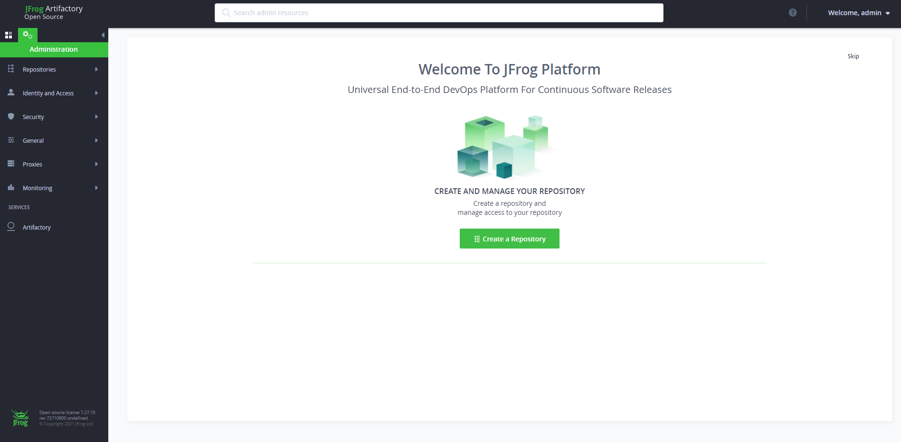

# Install JFrog Artifactory using Docker

## Pre-requistes:

* Choose at least small or medium instance type (2GB RAM)
* ports 8081 and 8082 needs to be opened.
* 8081 for Artifactory REST APIs.
* 8082 for everything else (UI, and all other product’s APIs). 

## Install Docker and Docker Compose on Instance

See documentation [here](../Docker/install-docker.md)

## Install JFrog Artifactory Docker Container

### Step 1. Download Artifactory Docker image
```
sudo docker pull docker.bintray.io/jfrog/artifactory-oss:latest 
```

### Step 2. Display docker images
```
sudo docker images
```

### Step 3: Create Data Directory

Create data directory on host system to ensure data used on container is persistent.
```
sudo mkdir -p /jfrog/artifactory
sudo chown -R 1030 /jfrog/
```

### Step 4: Start JFrog Artifactory container

//To start an Artifactory container, use the command:
```
sudo docker run --name artifactory -d -p 8081:8081 -p 8082:8082 \
-v /jfrog/artifactory:/var/opt/jfrog/artifactory \
docker.bintray.io/jfrog/artifactory-oss:latest
```

### Step 5: Run Artifactory as a service
```
sudo vi /etc/systemd/system/artifactory.service
```
Copy the below code  
```
[Unit]
Description=Setup Systemd script for Artifactory Container
After=network.target

[Service]
Restart=always
ExecStartPre=-/usr/bin/docker kill artifactory
ExecStartPre=-/usr/bin/docker rm artifactory
ExecStart=/usr/bin/docker run --name artifactory -p 8081:8081 -p 8082:8082 \
  -v /jfrog/artifactory:/var/opt/jfrog/artifactory \
  docker.bintray.io/jfrog/artifactory-oss:latest
ExecStop=-/usr/bin/docker kill artifactory
ExecStop=-/usr/bin/docker rm artifactory

[Install]
WantedBy=multi-user.target 
```

Save and exit from vi editor


```sh
#Reload Systemd
sudo systemctl daemon-reload

#Then start Artifactory container with systemd.
sudo systemctl start artifactory

#Enable it to start at system boot.
sudo systemctl enable artifactory

#Check whether Artifactory Service is running
sudo systemctl status artifactory
```

### Step 6: Access Artifactory Web Interface
```
http://server_ip:8081/

You should see Artifactory welcome page.
```


### Default username password for JFrog
```
Username: admin, Password: password
```

