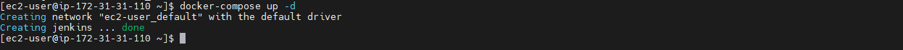
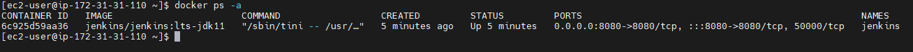
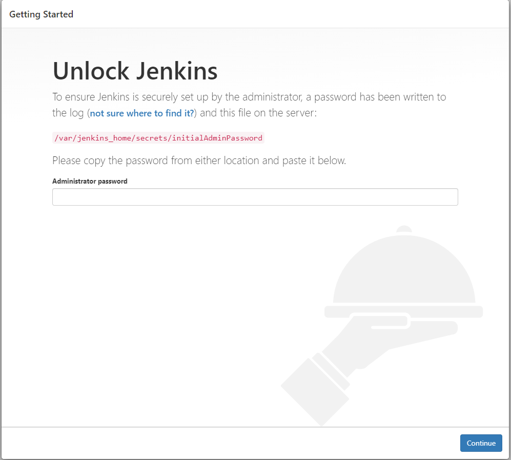

# Install Jenkins using Docker Compose

## Pre-requistes:

* Choose at least small or medium instance type (2GB RAM)
* port 8080 needs to be opened.
* 8080 Jenkins Default Port.

## Step 1

### Install Docker and Docker Compose on Instance

See documentation [here](../Docker/install-docker.md)

## Step 2

### Create Volume for Jenkins

```sh
mkdir -p /home/ec2-user/jenkins_data/jenkins_home
```

## Step 3

### Create docker-compose.yml file

```
vi docker-compose.yml
```
Paste the below code and save the file.

```
version: '3'

services:
  jenkins:
    container_name: jenkins
    image: jenkins/jenkins:lts-jdk11
    restart: unless-stopped
    ports:
      - "8080:8080"
    volumes:
      - "/home/ec2-user/jenkins_data/jenkins_home:/var/jenkins_home"
```

## Step 4

### Run Docker-compose file

```
docker-compose up -d
```


### Docker Commands to view containers

```
docker ps -a
```


### You can access Jenkins Web Interface

```
jenkinsr URL: http://server-ip-address:8080
```

You can get Unloak Jenkins Screen



### Get the Initial Admin Password
```
cd jenkins_data/
cat jenkins_home/secrets/initialAdminPassword
```
copy the password and paste on that textbox and click continue.

* After install Basic plugins or skip this step
* Next configure admin user or skip this also

if you configure admin user login with this user name and password or default user is **admin** and password is in initialAdminPassword or Reset the admin password


