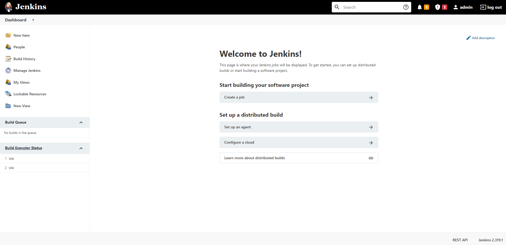

# Install Jenkins using Docker Compose

## Pre-requistes:

* Choose at least small or medium instance type (2GB RAM)
* port 8080 needs to be opened.
* 8080 Jenkins Default Port.

## Step 1

### Run the below script to install jenkins
```sh
sudo amazon-linux-extras install epel -y 
sudo yum update -y
sudo yum install java-1.8.0
sudo yum remove java-1.7.0-openjdk
sudo wget -O /etc/yum.repos.d/jenkins.repo http://pkg.jenkins-ci.org/redhat/jenkins.repo
sudo rpm --import http://pkg.jenkins-ci.org/redhat/jenkins-ci.org.key
sudo yum install jenkins -y
sudo service jenkins start
sudo chkconfig --add jenkins
```

### You can access Jenkins Web Interface

```
jenkinsr URL: http://server-ip-address:8080
```

### Get the Initial Admin Password from mentioned path
```
cat ##PATH##
```

copy the password and paste on that textbox and click continue.

* After install Basic plugins or skip this step
* Next configure admin user or skip this also

if you configure admin user login with this user name and password or default user is **admin** and password is in initialAdminPassword or Reset the admin password

