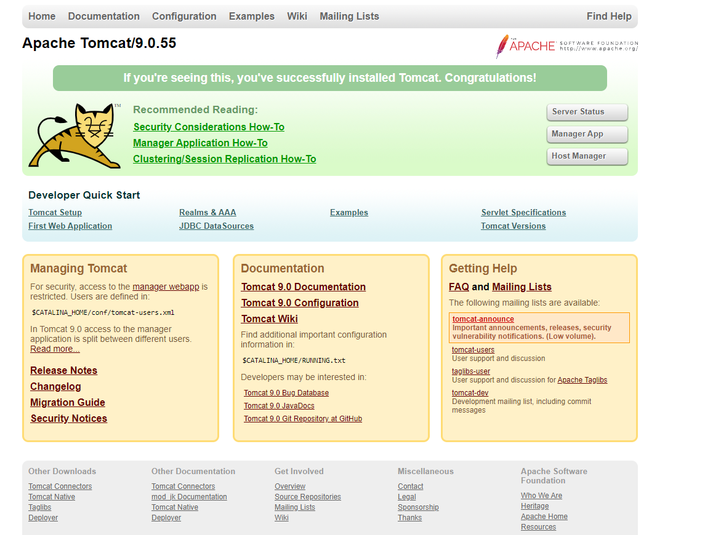

# Change Tomcat Default Port 8080 to 8090

## Open Server.xml file and edit the configuration

```sh
cd apache-tomcat-9.0.55

cd conf

vi server.xml
```
## Change Tomcat Default Port 8080 to 8090 in Connecter tag section


## Restart the Tomcat Server.

### Check Tomcat port was changed
```
http://server_ip:8090/

You should see Tomcat welcome page.
```


