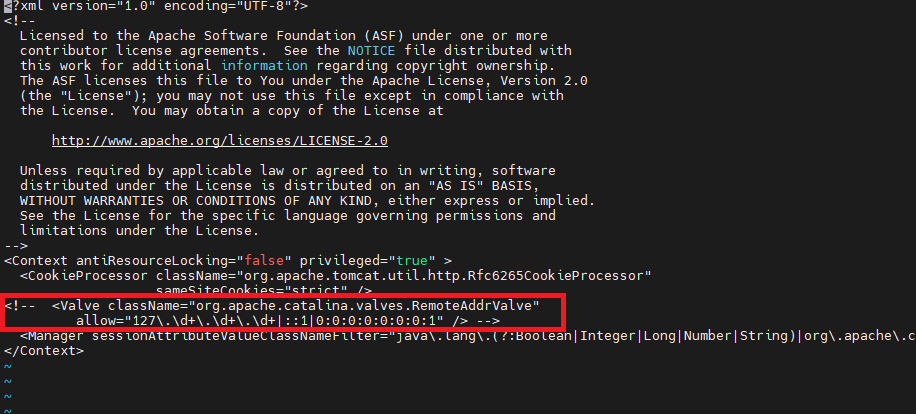
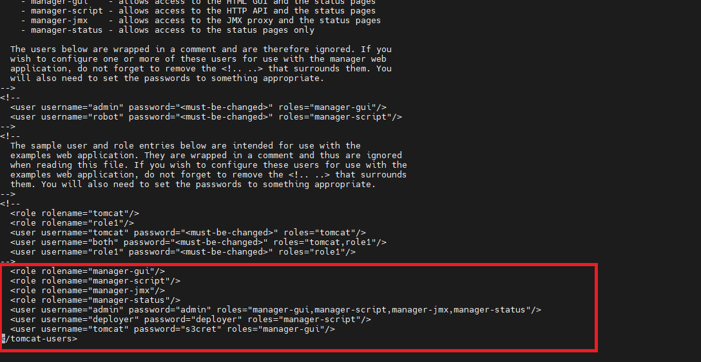
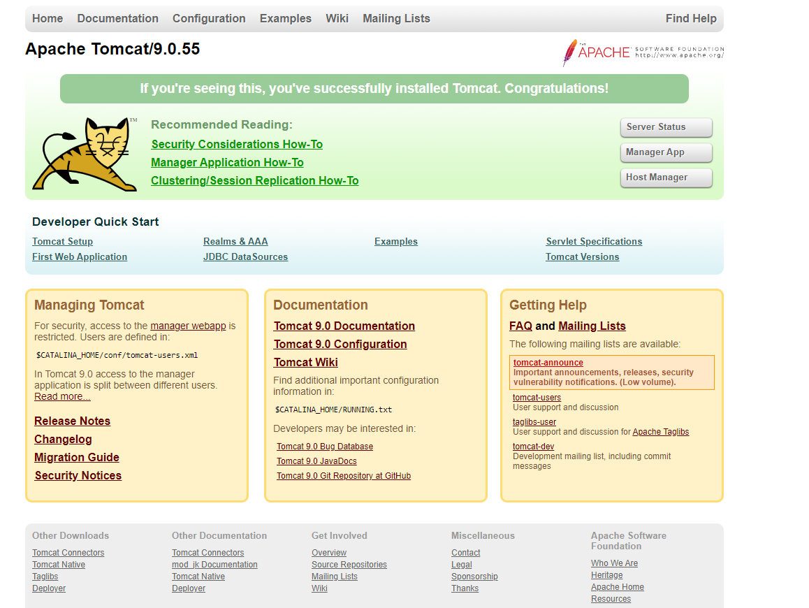

# Install Tomcat Server in AWS EC2

## Pre-requistes:

Choose at least small or medium instance type (2GB RAM)
ports 8080 needs to be opened.
8080 for Tocat Default port.

## Install Java
```
yum install java-1.8*
```
## Install Tomcat

```sh

sudo su -

cd /

cd /opt

#Download tomcat binary
wget https://dlcdn.apache.org/tomcat/tomcat-9/v9.0.55/bin/apache-tomcat-9.0.55.tar.gz

#unzip tomcat binary
tar -zvxf apache-tomcat-9.0.55.tar.gz

```
## Add Execute Permission to startup.sh & shutdown.sh
```
cd apache-tomcat-9.0.55

cd bin

chmod +x startup.sh
chmod +x shutdown.sh
```

## Create link files for Tomcat Server up and Down

```
ln -s /opt/apache-tomcat-9.0.55/bin/startup.sh /usr/local/bin/tomcatup
ln -s /opt/apache-tomcat-9.0.55/bin/shutdown.sh /usr/local/bin/tomcatdown

tomcatup
```

## Check if Tomcat service running 
```
ps -ef | grep tomcat
```
## Change Settings to Manage Tomcat 

```sh
cd apache-tomcat-9.0.55

find -name context.xml

./conf/context.xml
./webapps/examples/META-INF/context.xml
./webapps/host-manager/META-INF/context.xml
./webapps/manager/META-INF/context.xml


#comment value tag sections in below all files

vi ./webapps/examples/META-INF/context.xml
vi ./webapps/host-manager/META-INF/context.xml
vi ./webapps/manager/META-INF/context.xml
```


## Update user information in tomcat-users.xml

```sh
cd apache-tomcat-9.0.55
cd conf

vi tomcat-users.xml

#Add below lines between <tomcat-users> tag

<role rolename="manager-gui"/>
<role rolename="manager-script"/>
<role rolename="manager-jmx"/>
<role rolename="manager-status"/>   
<user username="admin" password="admin" roles="manager-gui,manager-script,manager-jmx,manager-status"/>
<user username="deployer" password="deployer" roles="manager-script"/>
<user username="tomcat" password="s3cret" roles="manager-gui"/>
```



### Check Tomcat installed properly
```
http://server_ip:8080/

You should see Tomcat welcome page.
```




