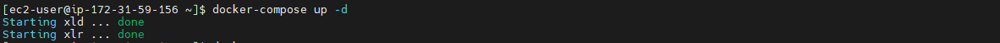
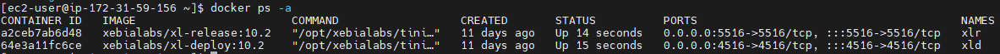
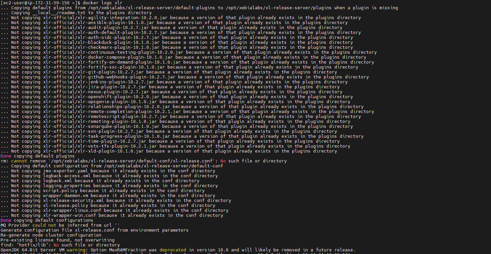
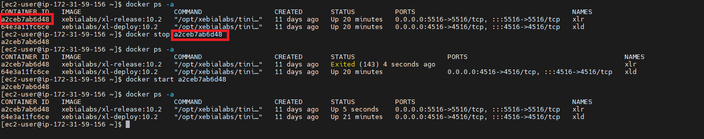

# Install XL Deploy and XL Release using Docker Compose

## Pre-requistes:

* Choose at least large or xlarge instance type (8GB RAM)
* ports 4516 and 5516 needs to be opened.
* 4516 for XL Deploy.
* 5516 for XL Release. 

## Step 1

### Install Docker and Docker Compose on Instance

See documentation [here](../Docker/install-docker.md)

## Step 2

## XL Deploy and XL Release with Volumes

### 2.Create Volumes for XL Deploy and XL Release

```sh
mkdir -p XebiaLabs/xl-deploy-server/conf
mkdir -p XebiaLabs/xl-deploy-server/hotfix/lib
mkdir -p XebiaLabs/xl-deploy-server/hotfix/plugins
mkdir -p XebiaLabs/xl-deploy-server/ext
mkdir -p XebiaLabs/xl-deploy-server/plugins
mkdir -p XebiaLabs/xl-deploy-server/repository
mkdir -p XebiaLabs/xl-deploy-server/repository
mkdir -p XebiaLabs/xl-deploy-server/repository

mkdir -p XebiaLabs/xl-release-server/conf
mkdir -p XebiaLabs/xl-release-server/hotfix/
mkdir -p XebiaLabs/xl-release-server/ext
mkdir -p XebiaLabs/xl-release-server/plugins
mkdir -p XebiaLabs/xl-release-server/repository
mkdir -p XebiaLabs/xl-release-server/archive
mkdir -p XebiaLabs/xl-release-server/archive

sudo chown -R 10001 ~/XebiaLabs/
```
### 3.Create docker-compose.yml file

```
vi docker-compose.yml
```
Paste the below code and change the ADMIN_PASSWORD save the file.

```
version: "2"
services:
  xld:
    image: xebialabs/xl-deploy:10.2
    container_name: xld
    ports:
      - "4516:4516"
    volumes:
      - ~/XebiaLabs/xl-deploy-server/conf:/opt/xebialabs/xl-deploy-server/conf
      - ~/XebiaLabs/xl-deploy-server/hotfix/lib:/opt/xebialabs/xl-deploy-server/hotfix/lib
      - ~/XebiaLabs/xl-deploy-server/hotfix/plugins:/opt/xebialabs/xl-deploy-server/hotfix/plugins
      - ~/XebiaLabs/xl-deploy-server/ext:/opt/xebialabs/xl-deploy-server/ext
      - ~/XebiaLabs/xl-deploy-server/plugins:/opt/xebialabs/xl-deploy-server/plugins
      - ~/XebiaLabs/xl-deploy-server/repository:/opt/xebialabs/xl-deploy-server/repository
      - ~/XebiaLabs/xl-deploy-server/repository:/opt/xebialabs/xl-deploy-server/export
      - ~/XebiaLabs/xl-deploy-server/repository:/opt/xebialabs/xl-deploy-server/work
    environment:
      - ADMIN_PASSWORD=admin
      - ACCEPT_EULA=Y

  xlr:
    image: xebialabs/xl-release:10.2
    container_name: xlr
    ports:
      - "5516:5516"
    links:
      - xld
    volumes:
      - ~/XebiaLabs/xl-release-server/conf:/opt/xebialabs/xl-release-server/conf
      - ~/XebiaLabs/xl-release-server/hotfix/:/opt/xebialabs/xl-release-server/hotfix/
      - ~/XebiaLabs/xl-release-server/ext:/opt/xebialabs/xl-release-server/ext
      - ~/XebiaLabs/xl-release-server/plugins:/opt/xebialabs/xl-release-server/plugins
      - ~/XebiaLabs/xl-release-server/repository:/opt/xebialabs/xl-release-server/repository
      - ~/XebiaLabs/xl-release-server/archive:/opt/xebialabs/xl-release-server/archive
      - ~/XebiaLabs/xl-release-server/archive:/opt/xebialabs/xl-release-server/reports
    environment:
      - ADMIN_PASSWORD=admin
      - ACCEPT_EULA=Y
```

## XL Deploy and XL Release no volumes

### 2.Create docker-compose.yml file

```
vi docker-compose.yml
```
Paste the below code and change the ADMIN_PASSWORD save the file.

```
version: "2"
services:
  xl-deploy:
    image: xebialabs/xl-deploy:10.2
    container_name: xl-deploy
    ports:
      - "4516:4516"
    environment:
      - ADMIN_PASSWORD=admin
      - ACCEPT_EULA=Y

  xl-release:
    image: xebialabs/xl-release:10.2
    container_name: xl-release
    ports:
      - "5516:5516"
    links:
      - xl-deploy
    environment:
      - ADMIN_PASSWORD=admin
      - ACCEPT_EULA=Y
```

## Step 3

### Run Docker-compose file

```
docker-compose up -d
```


### Docker Commands to view containers

```
docker ps -a
```


```sh
#To show only running containers
docker ps 
#To show all containers
docker ps -a 
#To show the latest created container
docker ps -l 
#To show n last created containers
docker ps -n=-1
#To display total file sizes
docker ps -s 
```

### View Docker Container Logs

```
docker logs xld
docker logs xlr
```



### To start stop docker containers 

```sh
#To Start Container
docker start <container id>
#To Start Containers
docker stop <container id>
```


### You can access Deploy and Release

```
xl-deploy-docker URL: http://server-ip-address:4516
xl-deploy-docker URL: http://server-ip-address:5516

Username: admin
Password: admin (this password is when create a docker-compose file ADMIN_PASSWORD=admin section)
```

## References

* https://docs.xebialabs.com/v.10.2/deploy/docker/getting-started-with-xl-docker-containers/#setup-release-and-deploy-using-docker-compose

* https://docs.xebialabs.com/v.10.2/release/docker/single-node-docker-deployments/#single-node-deploy-and-release-deployment

* https://docs.xebialabs.com/v.9.8/release/docker/manage-volumes-in-docker/

* https://hub.docker.com/r/xebialabs/xl-deploy

* https://hub.docker.com/r/xebialabs/xl-release/

* https://legacydocs.xebialabs.com/community/

